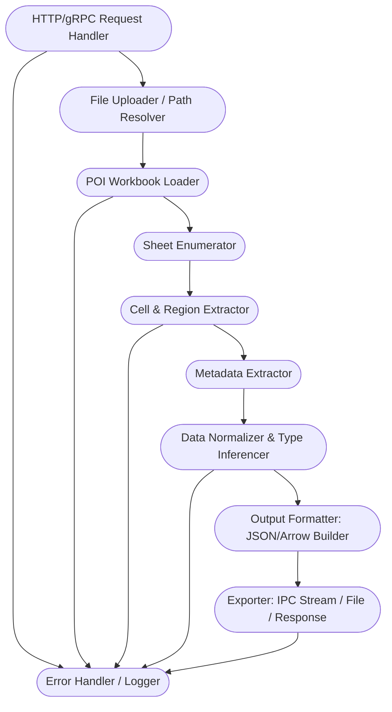

# Sketch diagram for the Excel Parser Service

Perfect — here’s a **focused internal sketch** for the core logic of
**[Excel Parser Microservice (Java + Apache POI)]**.
This shows each main component/module and data flow inside the service:

---

## 🛠️ Sketch: Excel Parser Microservice (Java + Apache POI)

---

### **Component Breakdown**

* **HTTP/gRPC Request Handler**
  Accepts file uploads, file paths, request params (sheet selection, region, output type).

* **File Uploader / Path Resolver**
  Handles multipart uploads or fetches files from GCS/S3/local.

* **POI Workbook Loader**
  Loads workbook (`.xls`/`.xlsx`) with POI, handles password protection, encodings.

* **Sheet Enumerator**
  Iterates over all sheets, collects sheet-level metadata.

* **Cell & Region Extractor**
  Reads all rows/cells; detects data blocks, merged cells, formula cells, rich text.

* **Metadata Extractor**
  Gathers styles, named ranges, comments, document properties.

* **Data Normalizer & Type Inferencer**
  Standardizes values, infers types per column, fills nulls, validates ranges.

* **Output Formatter: JSON/Arrow Builder**
  Serializes to:

  * Structured JSON (schema, metadata, data arrays)
  * Arrow Table (via Java Arrow, if enabled)

* **Exporter: IPC Stream / File / Response**
  Returns data as HTTP/gRPC response, writes to disk, or streams Arrow IPC.

* **Error Handler / Logger**
  Captures and logs all errors, edge cases, and operational telemetry.

---

### 💡 **Notes**

* You can extend by plugging in **profiling, validation, or human-in-the-loop modules** before export.
* Optional: add a **config module** (e.g., sheet inclusion, column filters, safe mode for PII).

---

Let me know if you want a **Java package/folder structure** or an **OpenAPI endpoint spec** for this microservice!
